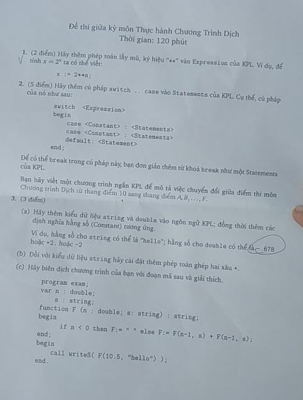

## Môn Thực Hành Chương trình dịch 20192.

### Thông tin
<b>Giáo viên</b>: Trần Vĩnh Đức

<b>Môn học</b>: Thực hành chương trình dịch.

<b>Lớp</b>: CNTT Việt Nhật - ĐH Bách Khoa Hà Nội.

### Đề Thi 
<div style="text-align: center">

</div>

### Cách làm 
Trong các file có mã TODO theo bài -> Search theo TODO
### Cách chạy code 
Fix lỗi thiếu thư viện curse.h trên ubuntu khi chạy bị báo lỗi.

```cmd
$ sudo apt-get install libncurses5
$ sudo apt-get install libncurses5-dev
```

Trong thư mục completed chạy từng câu lệnh sau trong terminal:

```cmd 
$ make clean 
$ make
$ ./kplc ../tests/example2.kpl ../tests/ex2  -dump 
``` 

Make lại file chạy kplc => Chạy để  biên dịch file example2.kpl thành file  binary ex2. Thêm option -dump để xem mã trong Code Buffer sau khi đọc file KPL 

Trong thư mục interpreter chạy các lệnh sau trong terminal:
```cmd
$ make clean
$ make 
$ ./kplrun ../tests/ex2
```

Make lại file chạy kplrun => Chạy file binary ex2 vừa tạo ra để xem kết quả.

#### Bai 1: TODO:1

token.h 
- Thêm SB_EXP vào tokenType

token.c
- Thêm case SB_EXP vào tokenToString()

scanner.c
- Thêm case SB_EXP vào printToken()
- Sửa lại case CHAR_TIMES trong ham getToken

parser.c
- Thêm case SB_EXP vào compileTerm2 => Đọc lại văn phạm.

codegen.h 
- Thêm định nghĩa hàm genEXP(void) 

codegen.c
- Thêm hàm genEXP(void) => Sinh code của hàm mũ

instructions.h trong thư mục completed, interpreter
- Thêm định nghĩa hàm emitEXP() xử lý việc tính toán hàm mũ
- Thêm định nghĩa OP_EXP vào enum Opcode => opcode của phép toán mũ

instructions.c trong thư mục completed, interpreter
- Thêm hàm emitEXP => Tạo mã lệnh xử lý phép toán mũ trong Code buffer 
- Thêm case OP_EXP vào hàm printInstruction() => In lệnh OP_EXP

vm.c 
- Thêm thư viện #include <math.h> => Tính hàm mũ
- Thêm case OP_EXP vào hàm run()  => Xử lý tính toán trong stack


